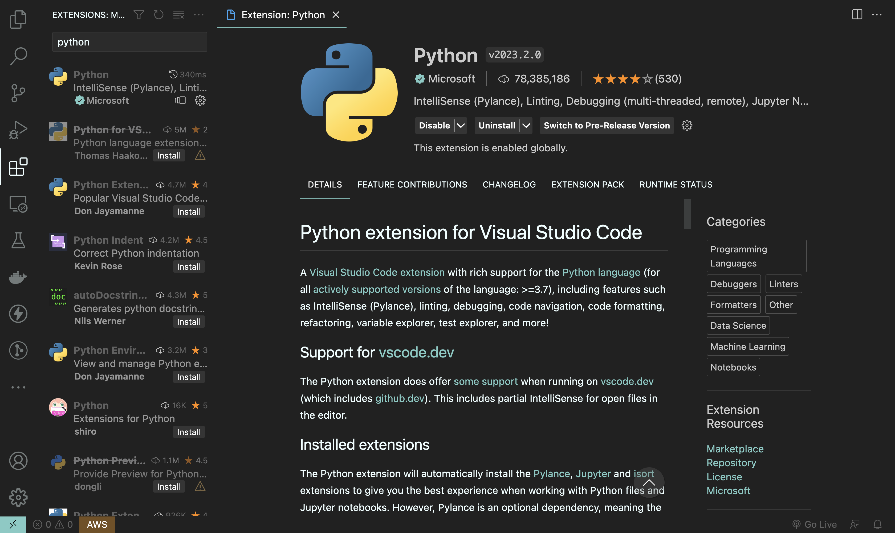

## Install python

---------------------------------------

### On Windows

1. Head to [python.org](https://www.python.org/downloads/)

    Download python and run the installer

### on Mac

1. Head to [python.org](https://www.python.org/downloads/)
   Download python and run the installer

2. create a virtual Environment (advanced), Read this [article](https://www.freecodecamp.org/news/python-version-on-mac-update/) 

---------------------------------------

## Check Python Version

### On windows

```bash
    python --version
```

### On Mac

```bash
    python3 --version
```

Install the python Extension in vs code

.

---------------------------------------

### Project setup

install request Package

### On windows

```bash
    pip install requests
```

### On Mac

```bash
    pip3 install requests
```